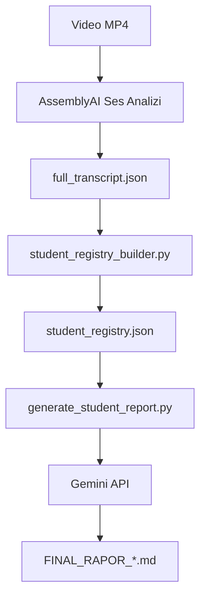

# Öğrenci Analiz Sistemi

## 🎯 Amaç
Video ders kayıtlarından öğrenci performans analizleri ve raporları oluşturan tam otomatik sistem.

## 📁 Klasör Yapısı

```
ogrenci_analiz_sistemi/
├── core/                           # Ana analiz motoru
│   ├── student_registry_builder.py  # Öğrenci-speaker eşleştirmesi
│   ├── generate_student_report.py  # Öğrenci raporu oluşturma
│   ├── extract_full_transcript.py   # Transkript çıkarma
│   ├── name_mapper.py              # İsim matching algoritması
│   └── schemas.py                  # Veri modelleri
├── video_processing/               # Video ve ses işleme
│   ├── assemblyai_client.py        # AssemblyAI ses analizi
│   ├── gemini_client.py            # Gemini API entegrasyonu
│   ├── transcript_format.py        # Transkript formatlama
│   └── run_pipeline.py             # Tam pipeline script'i
├── data/                           # Giriş verileri
│   ├── student_registry.json       # Öğrenci kayıtları
│   ├── full_transcript.json        # Tam ders transkripti
│   ├── llm_report.md              # Genel LLM raporu
│   └── frames/                    # Video frame'leri (18 adet)
│       ├── student_Hayal.jpg       # Hayal'in frame'i
│       ├── student_Zehra_Bozkurt.jpg # Öğretmen frame'i
│       └── ...                     # Diğer öğrenci frame'leri
├── output/                         # Çıktılar
│   ├── FINAL_RAPOR_Gökçe_Ece.md    # Gökçe'nin raporu
│   ├── FINAL_RAPOR_bora.md         # Bora'nın raporu
│   └── FINAL_RAPOR_Ali_Kıvanç.md   # Ali Kıvanç'ın raporu
├── .env.example                    # Konfigürasyon şablonu
└── README.md                       # Bu dosya
```

## 🔄 Süreç Akışı



## 🚀 Kullanım

### 1. Öğrenci Kayıt Sistemi
```bash
cd core
py student_registry_builder.py
```
- Transkriptten öğrenci-speaker eşleştirmesi oluşturur
- `student_registry.json` dosyası üretir

### 2. Öğrenci Raporu Oluşturma
```bash
cd core
py generate_student_report.py "Öğrenci Adı"
```
- Öğrenciye özel detaylı rapor oluşturur
- Markdown formatında çıktı verir

### 3. Transkript Çıkarma
```bash
cd core
py extract_full_transcript.py
```
- AssemblyAI verisinden okunabilir transkript oluşturur

### 4. GCS Video'dan MP3 Çıkarma
```bash
py stream_audio.py "Lesson_Records/ders_videosu.mp4"
```
- Videoyu `GCS_BUCKET_VIDEOS` / `GCS_FULL_VIDEOS_BUCKET` bucket'ından okur
- FFmpeg ile MP3'e çevirir
- MP3 dosyasını `GCS_BUCKET_AUDIO` bucket'ına, varsayılan olarak `lectureai_audio/{video_id}.mp3` olacak şekilde yükler
- Sadece dosya adı verilirse otomatik `Lesson_Records/` prefix'i eklenir

### 5. Öğrenci Örnek Sesi ile Speaker Eşleştirme
```bash
py speaker_identity_pipeline.py --video "ders_videosu.mp4" --student "İrem" --reference "data/irem.mp3"
```
- Video MP3'e çevrilip `lectureai_audio` bucket'ına yüklenir
- AssemblyAI konuşmacıları `Speaker A/B/C` olarak ayırır
- Referans ses, videodaki speaker segmentleriyle karşılaştırılır
- En iyi eşleşme `core/registry_output/student_registry.json` ve ayrıca match result JSON dosyasına yazılır

MP3 oluşturmadan doğrudan video URL'siyle çalıştırmak için:
```bash
py speaker_identity_pipeline.py --video "ders_videosu.mp4" --student "İrem" --reference "data/irem.mp3" --direct-video
```

Referans öğrenci sesi de GCS bucket'tan alınacaksa:
```bash
py speaker_identity_pipeline.py --video "ders_videosu.mp4" --student "İrem" --reference-blob "irem.mp3" --direct-video
```

### 6. Modal T4 ile Speaker Eşleştirme Denemesi
```bash
pip install modal
modal setup
modal secret create huggingface HF_TOKEN=hf_xxx
modal secret create lectureai-gcp --from-json C:\path\to\modal-gcp-secret.json
modal run modal_speaker_match.py --video-blob "Lesson_Records/ders_videosu.mp4" --student-audio-blob "yaman.mp3" --student "Yaman" --max-minutes 15
```
- AssemblyAI beklemeden Modal T4 üzerinde pyannote diarization + voice embedding eşleştirmesi yapar
- İlk çalıştırma model/image kurulumundan dolayı yavaş olabilir; sonraki çalıştırmalar daha hızlıdır
- `max-minutes` ilk denemelerde 10-15 tutulabilir
- `modal-gcp-secret.json` içeriği şu formatta olmalıdır: `{"GOOGLE_APPLICATION_CREDENTIALS_JSON": "<service-account-json-tek-satır>"}`

## 📊 Analiz Sonuçları

### Mevcut Öğrenciler
| Öğrenci | Speaker ID | Durum | Rapor |
|---------|------------|-------|-------|
| Gökçe Ece | B | ✅ Aktif | FINAL_RAPOR_Gökçe_Ece.md |
| Bora | D | ✅ Aktif | FINAL_RAPOR_bora.md |
| Ali Kıvanç | D | ✅ Aktif | FINAL_RAPOR_Ali_Kıvanç.md |
| Hayal | - | ❌ Sessiz | - |

### Rapor Formatı
Her rapor şu bölümleri içerir:
1. **Katılım & İletişim** - Sözel katılım, iletişim kalitesi
2. **Anlama & Problem Çözme** - Kavramsal anlama, teknik beceriler  
3. **Ders Akışına Uyum** - Dikkat, adaptasyon
4. **Güçlü Yönler** - Öne çıkan yetenekler
5. **Gelişim Önerileri** - İyileştirme tavsiyeleri

## 🔧 Gereksinimler

### Python Kütüphaneleri
```bash
pip install assemblyai google-genai httpx markdown xhtml2pdf
```

### API Key'ler
`.env` dosyasında gerekli:
```
ASSEMBLYAI_API_KEY=your_key_here
GEMINI_API_KEY=your_key_here
```

## 📈 Başarı Oranları

- **Öğrenci Tespiti:** 75% (3/4)
- **Rapor Başarısı:** 100% (tespit edilen öğrenciler için)
- **API Entegrasyonu:** ✅ Aktif
- **Format Standardı:** ✅ Tutarlı

## ⚙️ Konfigürasyon

### student_registry_builder.py
- Video ID'sini otomatik algılar
- İsim-speaker eşleştirmesi yapar
- Sessiz öğrencileri belirler

### generate_student_report.py
- Gemini 2.5 Flash kullanır
- Detaylı pedagojik analiz yapar
- Markdown formatında rapor üretir

## 🔍 İsim Mapping Algoritması

`name_mapper.py` şu işlemleri yapar:
1. OCR metinlerinden isim adayları çıkarır
2. Speaker diarizasyonu ile eşleştirir
3. Güven skorları hesaplar
4. Voice_Pending durumları belirler

## 🚨 Hata Yönetimi

### Yaygın Hatalar
- **VOICE_PENDING:** Ses verisi bulunamadı
- **API Limit:** Gemini API kota doldu
- **Transkript Bozuk:** AssemblyAI ses kalitesi düşük

### Çözümler
- Manuel isim eşleştirmesi
- API key yenileme
- Video ses kalitesi iyileştirme

## 📝 Notlar

1. **Ses Kalitesi:** Net ses kayıtları daha iyi sonuçlar verir
2. **İsim Benzerliği:** Benzer isimler karışabilir
3. **Speaker Sayısı:** 5+ speaker için performans düşer
4. **Ders Süresi:** 60+ dakika için segmentasyon gerekir

---

**Versiyon:** 1.0  
**Son Güncelleme:** 25.04.2026  
**Platform:** Windows PowerShell  
**Python:** 3.8+
