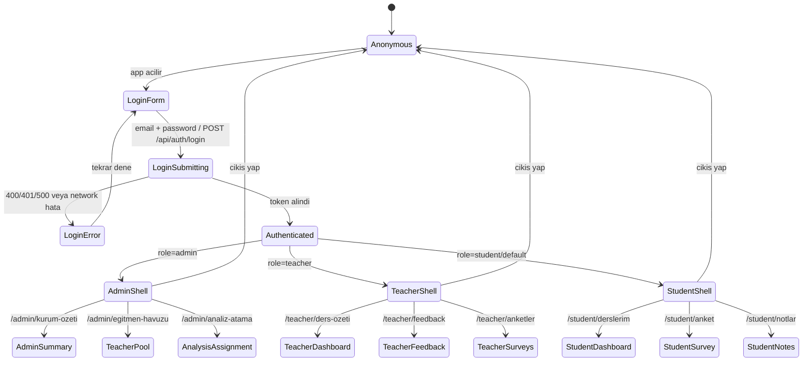
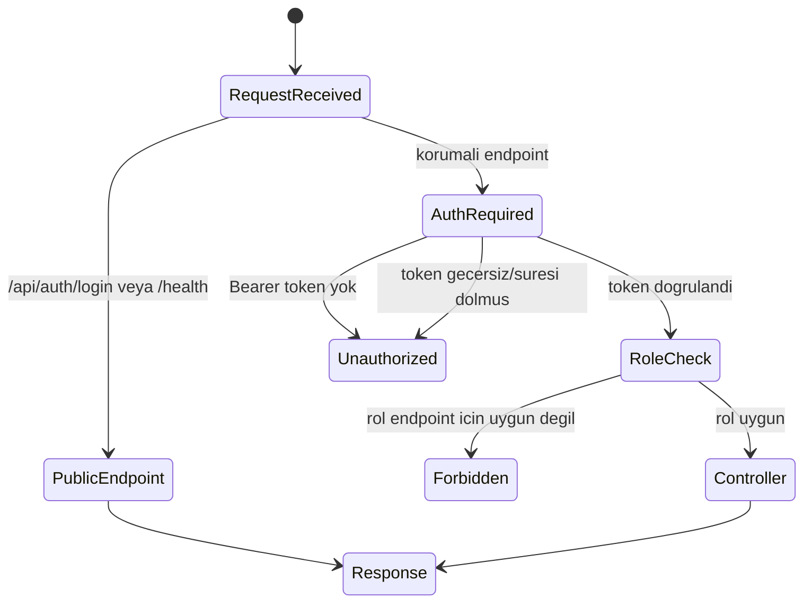
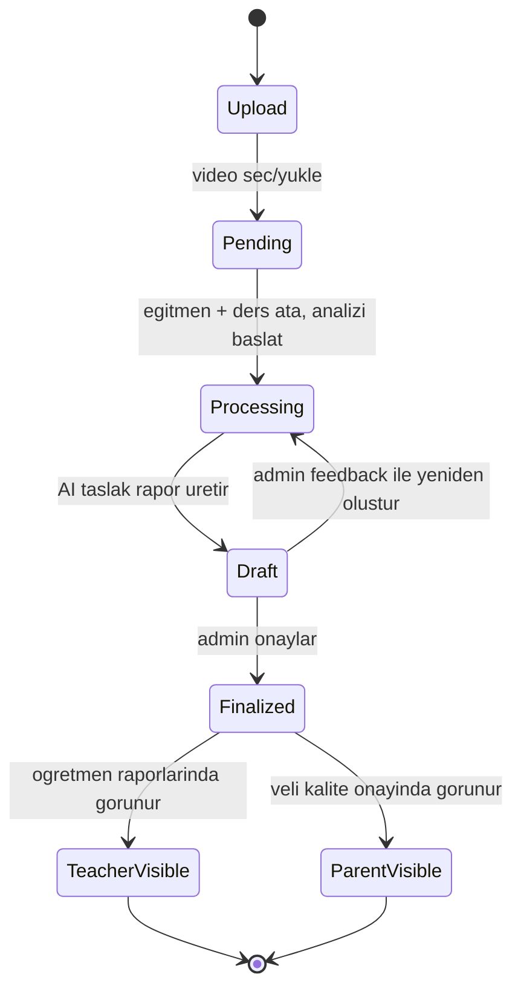
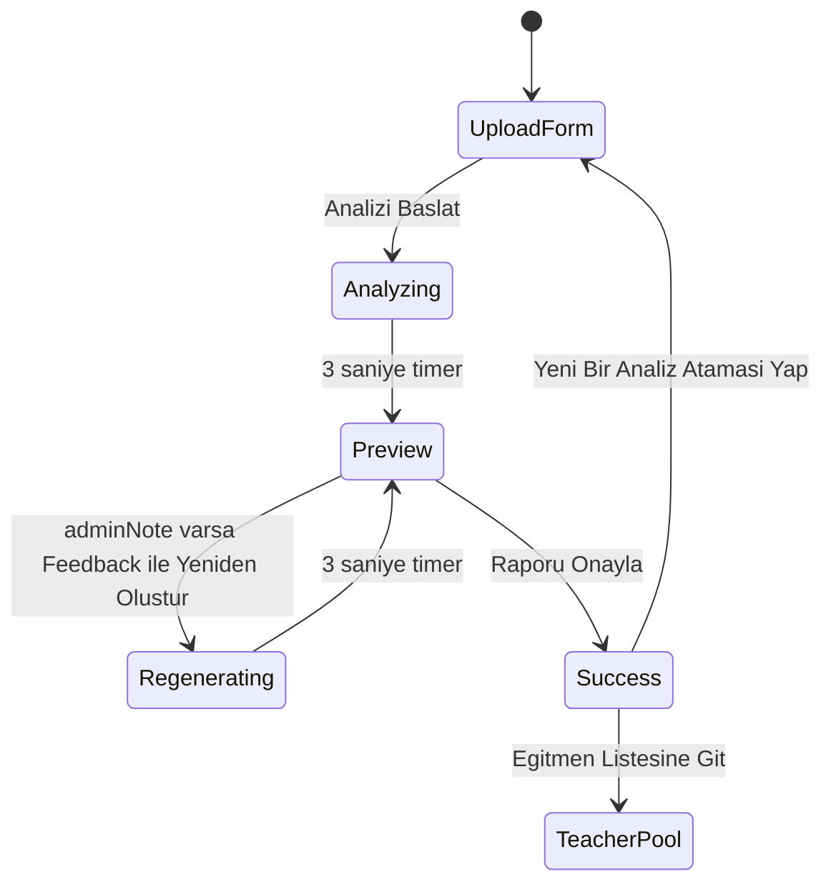
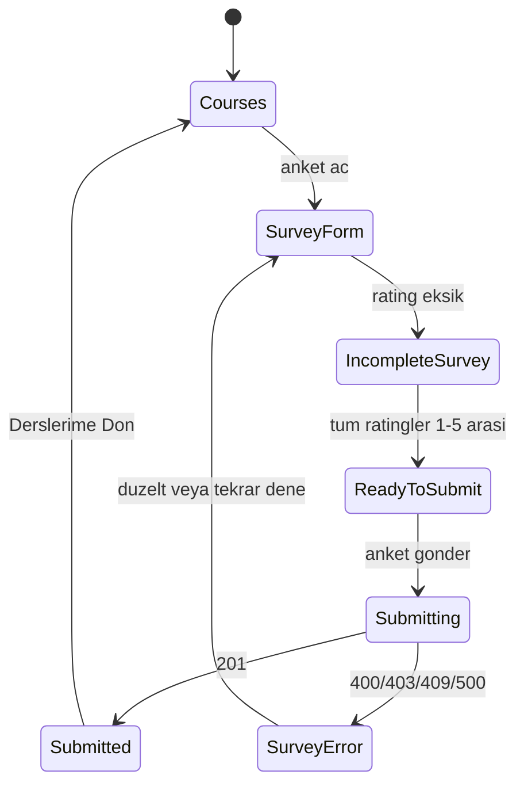
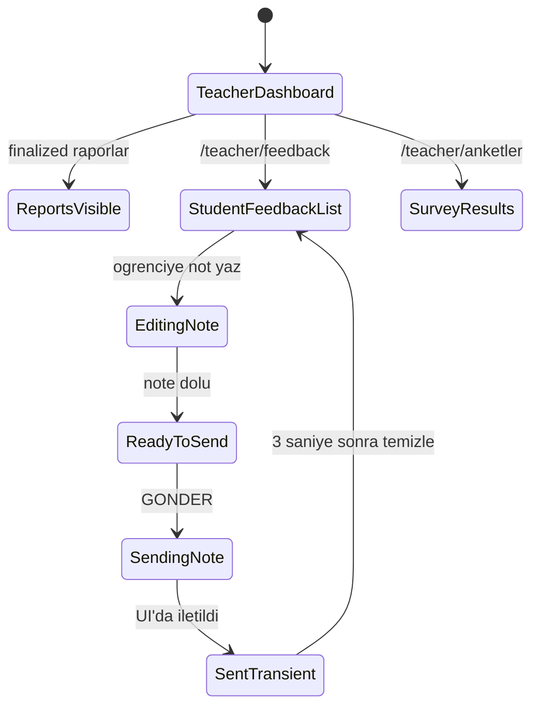
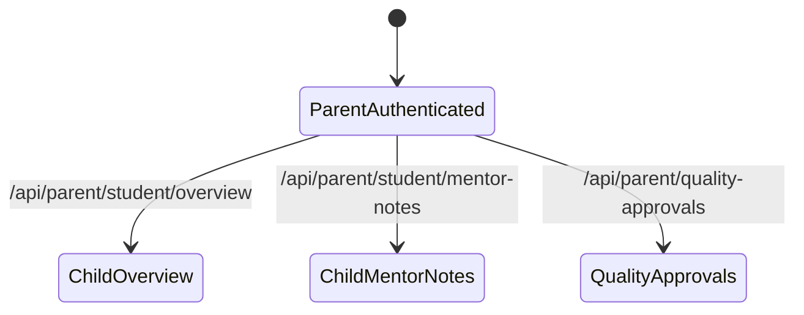
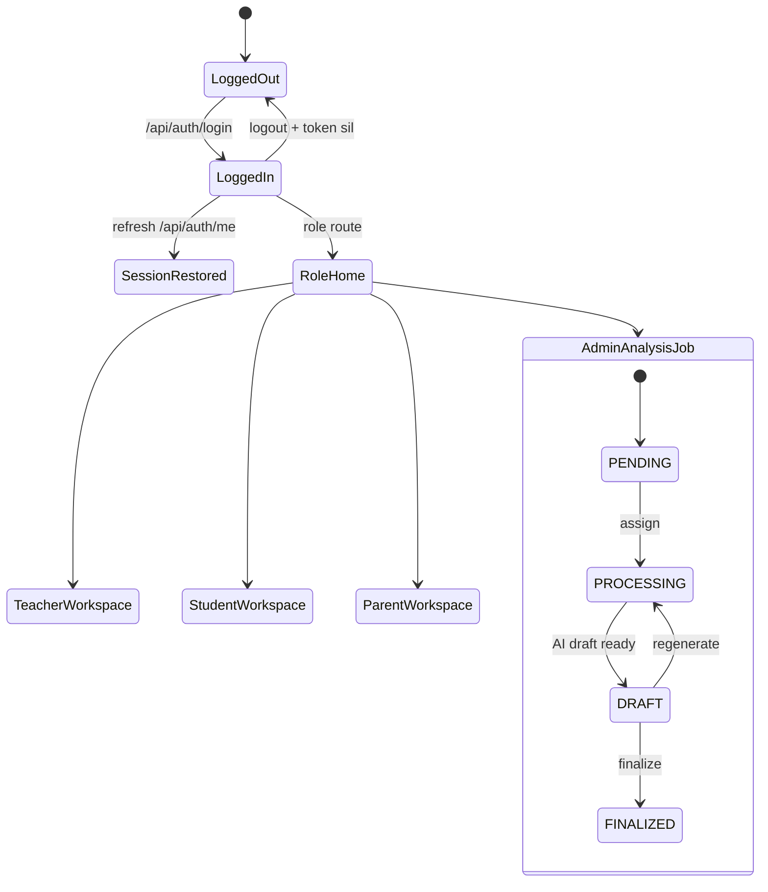

# LectureAI Web-App Flow and State Machine

Bu dokuman, `web-app` klasorundeki frontend ve backend akisini inceleyerek
uygulamanin durum makinelerini ozetler.

## Incelenen ana dosyalar

- Frontend router ve oturum kabugu: `frontend/src/App.jsx`
- Login ekrani: `frontend/src/Login.jsx`
- Admin analiz akisi: `frontend/src/admin/AnalysisWorkflow.jsx`
- Ogrenci anket akisi: `frontend/src/student/StudentSurvey.jsx`
- Ogretmen mentorluk notu akisi: `frontend/src/teacher/TeacherAttendance.jsx`
- API giris noktasi: `backend/src/app.js`
- Auth, rol ve endpoint kapilari:
  - `backend/src/routes/auth.routes.js`
  - `backend/src/routes/admin.routes.js`
  - `backend/src/routes/teacher.routes.js`
  - `backend/src/routes/student.routes.js`
  - `backend/src/middleware/auth.js`
  - `backend/src/middleware/roleGuard.js`
- Veri durumlari: `backend/prisma/schema.prisma`

## Genel uygulama akisi

Frontend, `BrowserRouter` icinde tek bir `AppContent` kabugu calistirir.
Baslangicta `isLoggedIn=false` oldugu icin kullanici `Login` ekranindadir.
Login basarili olunca rol bilgisine gore ilgili panele yonlendirilir:

- `admin` -> `/admin/kurum-ozeti`
- `teacher` -> `/teacher/ders-ozeti`
- diger/default -> `/student/derslerim`

Login sonrasi sidebar role gore farkli menu gosterir. Sayfa icerigi ise
React Router route'lariyla degisir.

## Auth ve rol kapisi

Backend tarafinda tum korumali endpoint'ler once JWT dogrulamasindan, sonra
rol kontrolunden gecer.

## Admin analiz state machine

Veri modelinde `AnalysisJob.status` su durumlari tasir:

- `PENDING`: video yuklendi, is henuz atanmamis/kuyrukta.
- `PROCESSING`: egitmen ve ders ile eslesti, analiz uretiliyor.
- `DRAFT`: taslak rapor admin kontrolunde.
- `FINALIZED`: admin onayladi, rapor ogretmen/veli tarafina acilabilir.

Backend endpoint'leri bu ideal akisi destekler:

- `POST /api/admin/analysis/upload` -> `PENDING`
- `POST /api/admin/analysis/assign` -> `PROCESSING`
- `GET /api/admin/analysis/draft/:jobId` -> taslak okuma
- `POST /api/admin/analysis/regenerate` -> feedback ile tekrar `PROCESSING`
- `POST /api/admin/analysis/finalize` -> `FINALIZED`

Frontend'deki `AnalysisWorkflow` ise su an mock/timer tabanli bir UI state
kullaniyor: `upload`, `isAnalyzing`, `preview`, `success`.

Frontend'in mevcut ekran state'i:

## Ogrenci akisi

Ogrenci panelinde ana durumlar:

- dersleri gorur
- anket ekranina gider
- 4 rating alanini doldurur
- opsiyonel yorum yazar
- form tamamlaninca submit aktif olur
- submit sonrasi basari ekranina gecer

Backend'deki kalici akis `POST /api/student/survey/submit` ile kurgulanmis:
ogrencinin derse kayitli olmasi gerekir ve ayni ders icin ikinci anket
engellenir.

## Ogretmen akisi

Ogretmen panelinde iki ana is parcasi var:

1. Admin tarafindan final hale getirilmis analiz raporlarini gorur.
2. Ogrenciye mentorluk notu yazar ve gonderir.

Backend:

- `GET /api/teacher/reports` sadece `FINALIZED` analizleri getirir.
- `POST /api/teacher/mentor-feedback` ogrenciye not kaydeder.
- `GET /api/teacher/reports/:lessonId/surveys` anonim/agregre anket sonucunu getirir.

## Veli akisi

Backend'de veli icin endpoint'ler var, fakat frontend router'da parent paneli
su an baglanmamis. Planlanan backend akisi:

## Dikkat edilmesi gereken uyumsuzluklar

1. `Login.jsx`, basarili login sonrasi `data.user.role.toLowerCase()` bekliyor.
   Backend `auth.controller.js` ise `user` nesnesi yerine `role`, `userId`,
   `name` alanlarini top-level donuyor. Bu haliyle login basarili olsa bile
   frontend `data.user` undefined oldugu icin kirilabilir.
2. Frontend login rol tablari sadece placeholder ve gorsel rol secimi gibi
   duruyor; gercek rol backend'deki kullanici kaydindan geliyor.
3. `localStorage` token'a yaziliyor, fakat `App` reload sonrasi token'i okuyup
   `/api/auth/me` ile oturum restore etmiyor. Sayfa yenilenince UI tekrar
   login ekranina duser.
4. `AnalysisWorkflow`, backend analiz endpoint'lerine bagli degil; mock data ve
   `setTimeout` ile calisiyor. Gercek state machine backend'deki `AnalysisJob`
   status alanina baglanmali.
5. Backend controller'inda `regenerateAnalysis`, status'u `PROCESSING` yapiyor
   fakat tekrar `DRAFT` durumuna geciren bir worker/pipeline gorunmuyor.
6. Parent API var, ancak frontend'de parent role route/menu yok.

## Onerilen hedef mimari

Tek kaynak state backend olursa UI daha tutarli olur:

